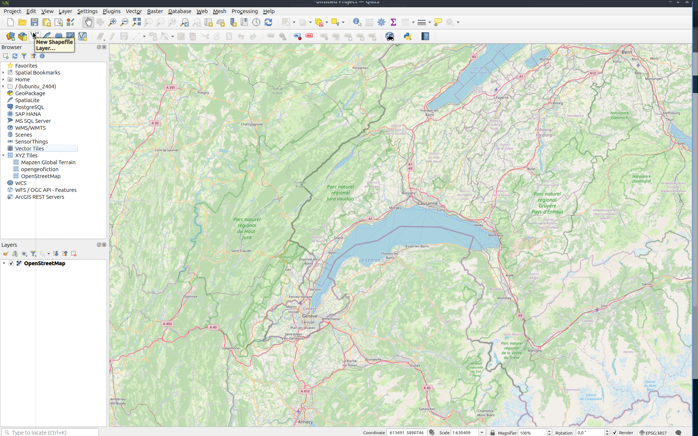
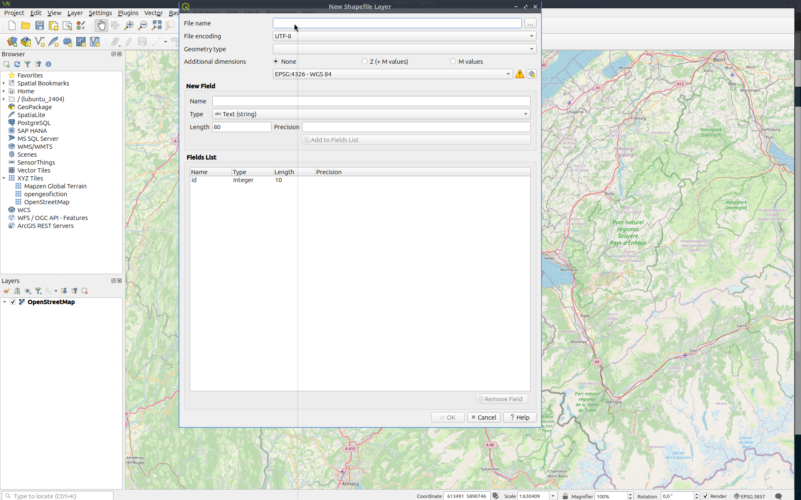
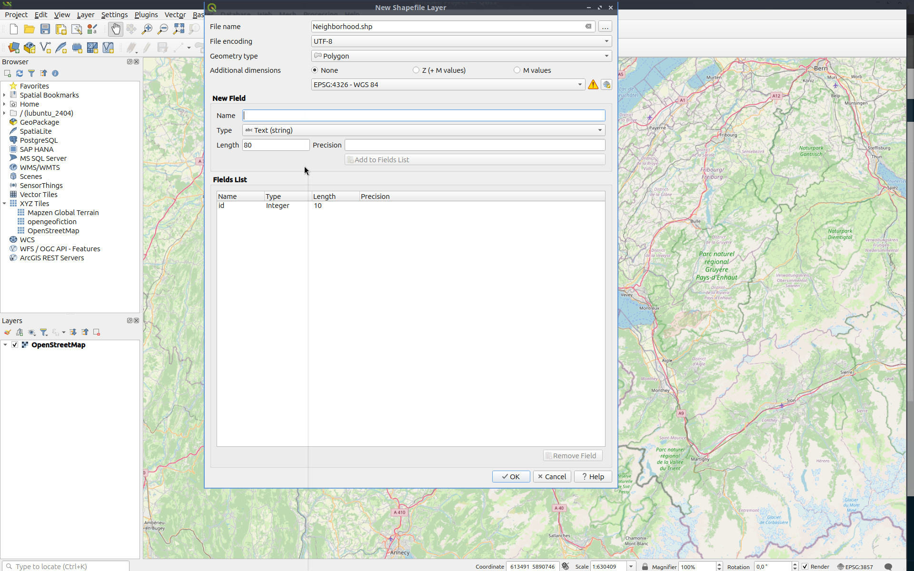
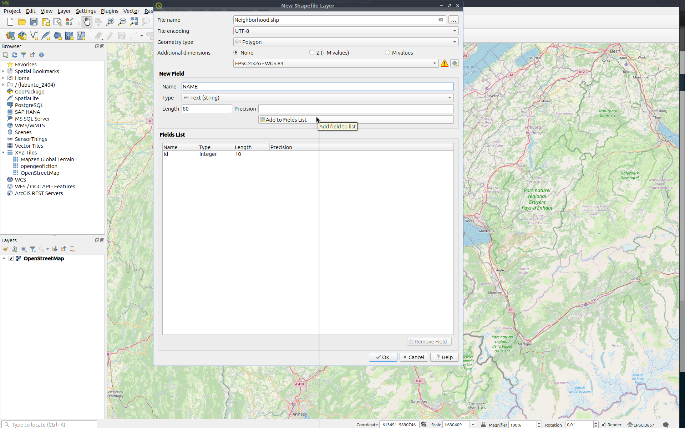
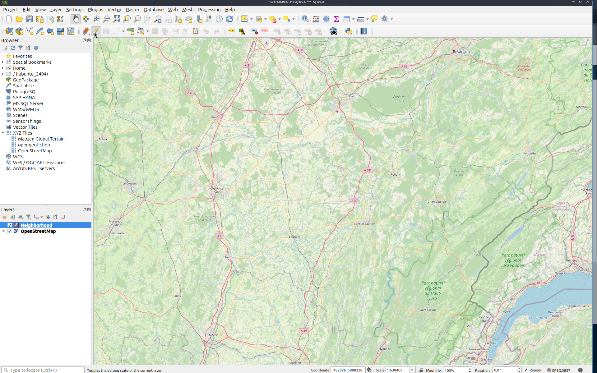
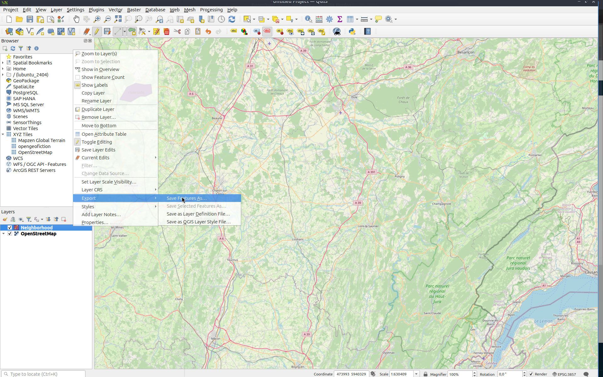

:::info
You can skip this section if you already have your shapefile at hand. 
:::

# Before starting
Decidim Geo add some GIS functionnality to decidim, and work with a special geo-data file type named Shapefile. 
A shapefile is a file that describe polygons: shape, name and other metadatas. 

Decidim Geo allows you to bind shapefiles to your decidim scopes. This enables use cases like: 

- Add one shape per neighborhood
- Add regions (south/east/oest) areas in the platform
- Use Decidim for a country/state and use geografic shapes.

## Prepare your shapes in QGIS
[QGIS](https://qgis.org/) is a desktop application to manipulate spacial data. It's an open-source software commonly used for geographical data. 
It enables many uses cases, as creating layers, polygons or points. In specific Decidim Geo use case, we will use QGIS to prepare polygonal shapes we will attribute later to Decidim scopes. 

**Install QGIS** 
[Install QGis for your distribution (Mac/Linux/Windows): https://qgis.org/download/](https://qgis.org/download/)

**Open QGIS and use the openstreet map tiles** 

**Add a Shapefile Layer** 

**Add details to the new layer** 

- File Name: the name of the layer you will work on
- File encoding: UTF-8
- Additional Dimention: None, in WGS-84

**Add a `NAME` field** 

- Name: NAME
- Type: Text
- Length: The max length for your shape label. 200 is enough normally

**Add field to list** 

**Select your new empty layer** 

**Click on edit - pencil button** 

Click on the pencil button of the topbar to start editing your shape. 

**Select polygon stencil** 

**Make your shape** 

Click after click, make your polygon. Once you are done, right-click to finalize the shape. 

**Complete the id and NAME field** 

- id: any numeric value. MUST be uniq between shapes
- NAME: the label you will use in Decidim to identificate the shape. It is not a label visible by the users of Decidim Geo, but only the admins.

**Add more shapes** 

**Export the shape** 

- Right click on the shape layer
- Go to Export > Save Feature As

**Export the shape** 

- Filename: Whatever you want, Avoid special characters, spaces, or upercases.
- Layer name: Same as filename
- CRS: WSG 84

Click on OK to export

**Find the exported files in your computer** 

- Select all the 6 generated files
- Compress in zip file these files

-> Done! You have a zip file that can be uploaded through the decidim administration

